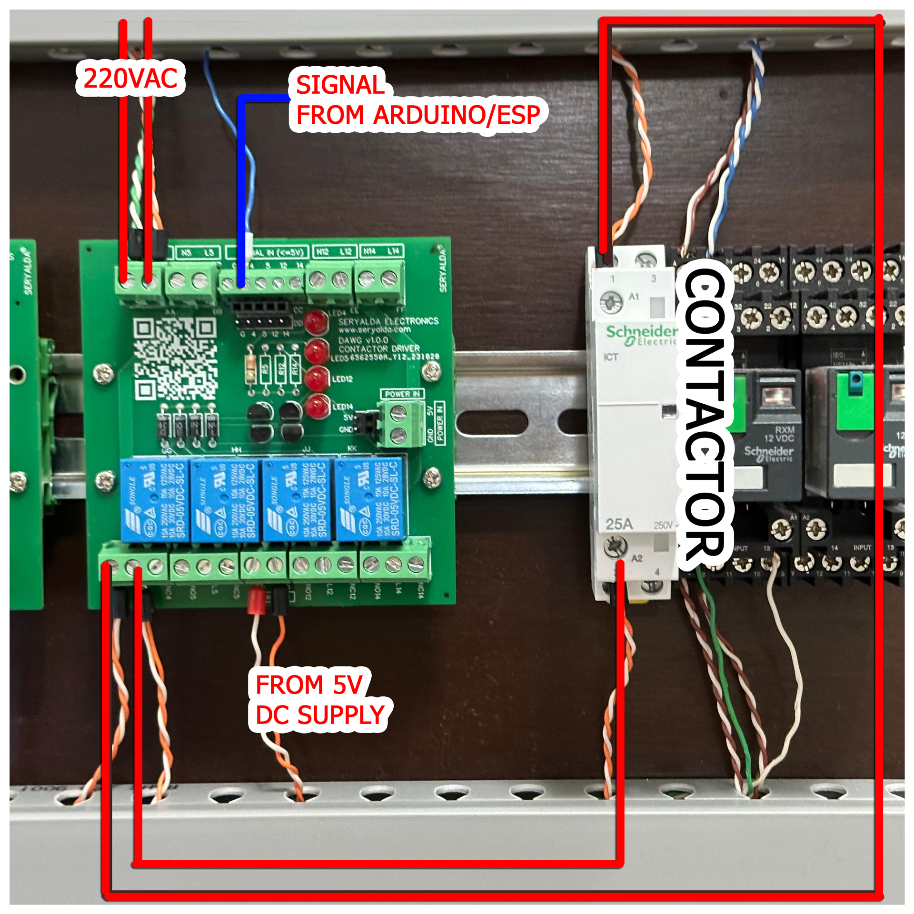
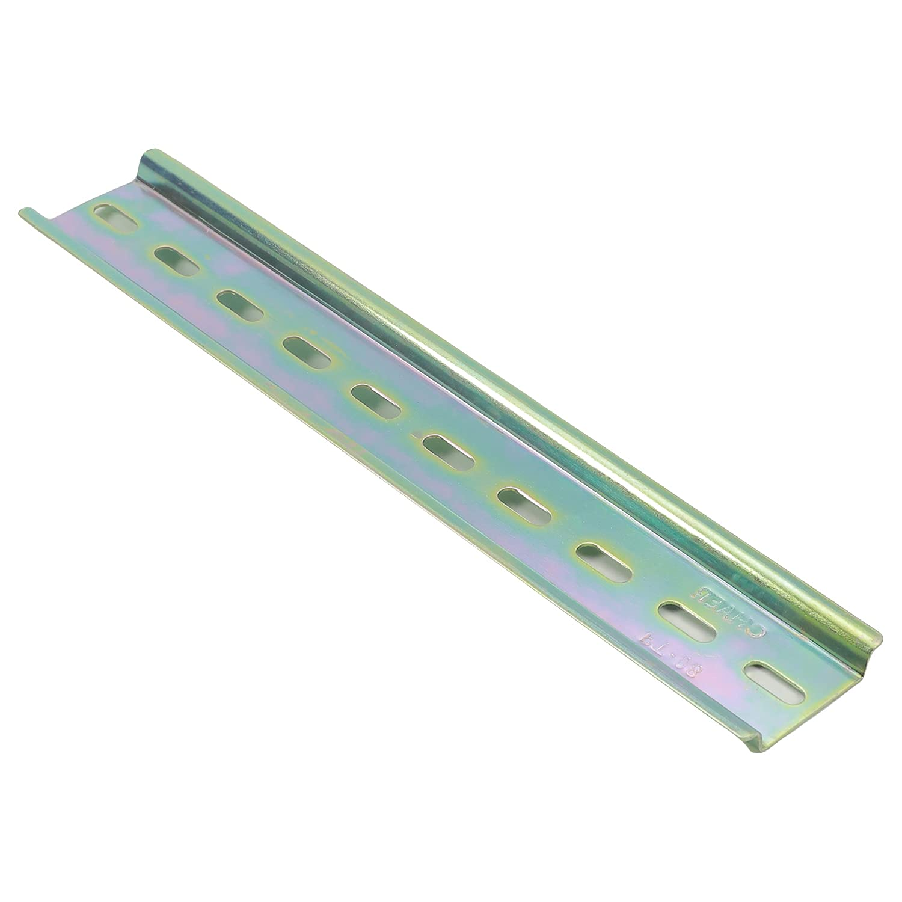

## Top
# 🎉 MARVIN 4-Channel DC Relay Driver Board with Voltage Jumper Settings v1.0.0
### ◀️ [Back](/)

<!--📷-->

## Table of Contents

- 🌐 [Overview](#overview)
- ⭐ [Features](#features)
- 🤔 [Things you need to know](#things-you-need-to-know)
- ⚙️ [Installation](#installation)
- 🖥️ [Compatible Processor Boards](#compatible-processor-boards)
- ❓ [FAQ](#faq)
- 📜 [Disclaimer](#disclaimer)
- 📝 [Demo](#demo)

## Overview

MARVIN is a specialized RAIL DIN board measuring 76mm x 86mm, featuring two screw holes with 25mm center-to-center distance, designed for 4-channel DC relay driving. Unlike standard relays, MARVIN facilitates the output of user-selected DC voltages (with jumper settings for 5VDC or 12VDC) to activate external DC relay switches.

The board includes input terminals—WJ124-3.81-5P-14-00A and Header-Female-2.54_1x5, DZ254R-11-05-63—connected to the microcontroller's output pins. Powered by an external 5VDC source, this relay driver offers a specialized solution for various electronics projects.

### Features
- 4-channel DC relay driver with jumper settings for 5VDC or 12VDC output.
- Input terminals connected to microcontroller output pins.
- Designed for activating external DC relay switches using user-selected DC voltages.
- Dimensions: 76mm x 86mm RAIL DIN board with screw holes for easy installation.
- Powered by an external 5VDC source for reliable performance.

[🔝 Top](#top)

## Things you need to know

NA

[🔝 Top](#top)

## Installation

Things and diagram you will need, for wiring and to implement RAIL DIN configurations:

| How to Wire Diagram | Sample Wiring | Slotted Metal Rail DIN  | Screws M3 D=3mm, L=6mm   | Mounting Brackets (25mm center to center) |
|--------------------|--------------------------------------------|-------------------------------------------------------------------------------------------------------|--------------------------------------------------------------------------------------------------------------------------------------------------|---------------|
|  |  |  |  |  |
|||[🛍️ BUYHERE](#)|[🛍️ BUYHERE](#)|[🛍️ BUYHERE](#)|

  
[🔝 Top](#top)

## Compatible Processor Boards

DAWG Board v1.0.0 also works with below Processor Board:

| Board              | Link                                       | Image                                                                                                 | Description                                                                                                                                      | GPIO Output Pins     |
|--------------------|--------------------------------------------|-------------------------------------------------------------------------------------------------------|--------------------------------------------------------------------------------------------------------------------------------------------------|---------------|
| **Foghorn v1.0.0** | [FOGHORN](https://github.com/seryalda/foghorn) |  | The board integrates with the Foghorn Version 1.0.0 Processor Board. It's an ESP8266 NodeMCU v3 compatible board with a screw terminal block output mapped to GPIO pins 4, 5, 12, and 14, allowing control of up to 4 external switch relays or CONTACTORS. | 4, 5, 12, 14 |

Explore the compatibility of DAWG with these processor boards to enhance your projects.

[🔝 Top](#top)

## FAQ

N/A

[🔝 Top](#top)

## Disclaimer

NA

[🔝 Top](#top)

## Demo

[🔝 Top](#top)

