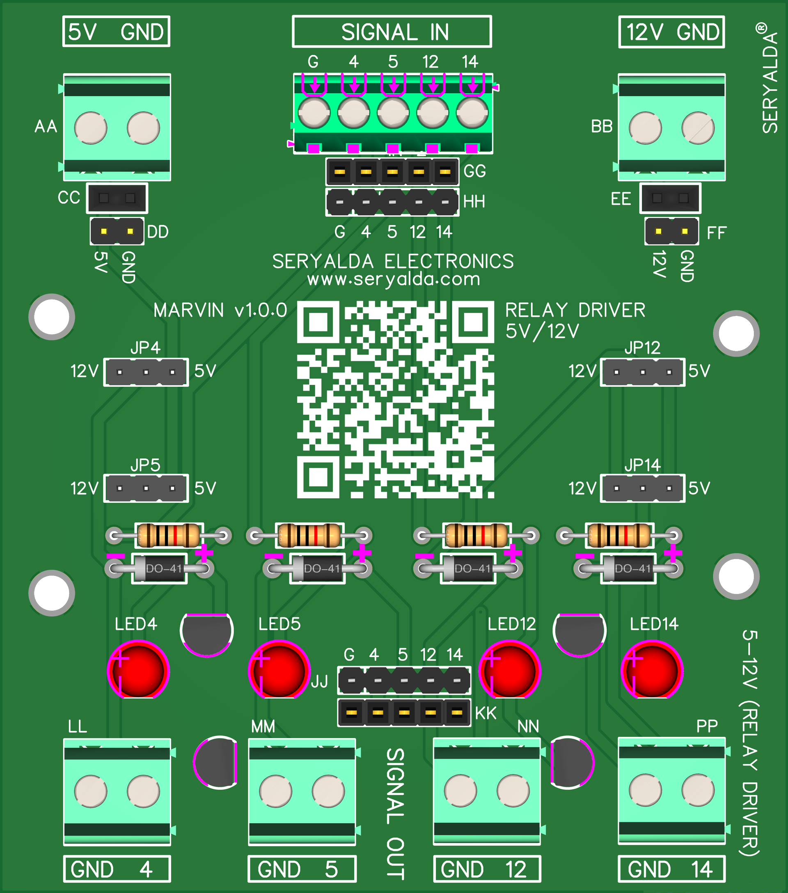

## Top
# MARVIN Board Version History

### 🏡 [Home](https://github.com/seryalda)

## Overview

### 4-Channel DC Relay Driver Control Board
MARVIN, a 76mm x 86mm board, focuses on controlling four DC relay switches, offering user-selectable 5VDC or 12VDC output options. Installation is straightforward with two screw holes. Its input terminals are designed for connection to microcontroller output pins, requiring an external 5VDC power source. Ideal for projects necessitating precise control over DC relay switches.

📚 Check out the different board versions below:

## Version
<!--
- [🚀 Version 1.0.0](./1.0.0) : This is the initial board version that started it all!
-->

| Version | Board Image | Release Date  | Remarks   | Notes |
|--------------------|--------------------------------------------|-------------------------------------------------------------------------------------------------------|--------------------------------------------------------------------------------------------------------------------------------------------------|---------------|
| [1.0.0](./1.0.0) |  | NOV 2023 | NA | Alright! |

[🔝 Top](#top)

## Changelog
- [📃 Logs and Releases](./changelog.md)

[🔝 Top](#top)
