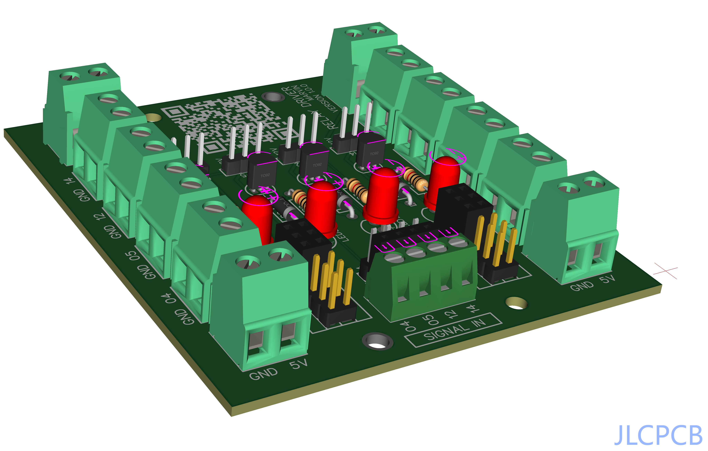
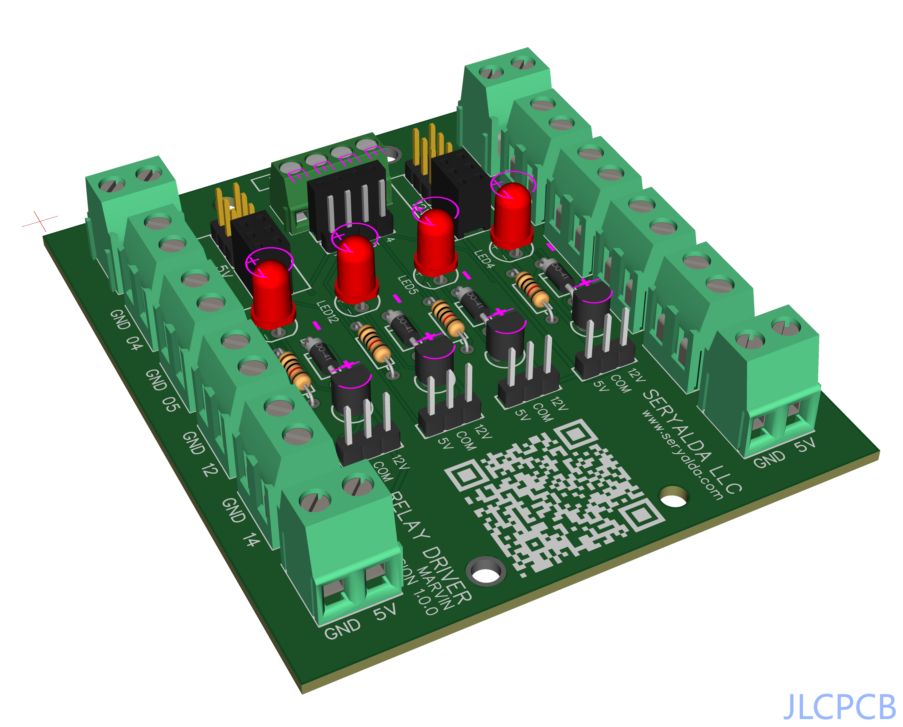
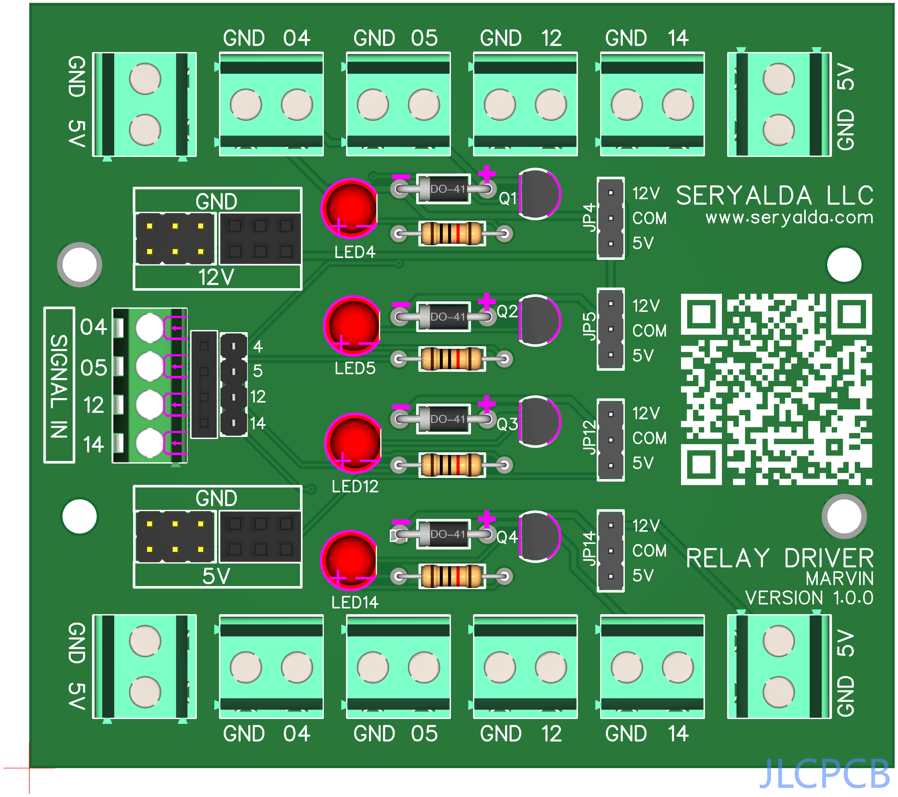
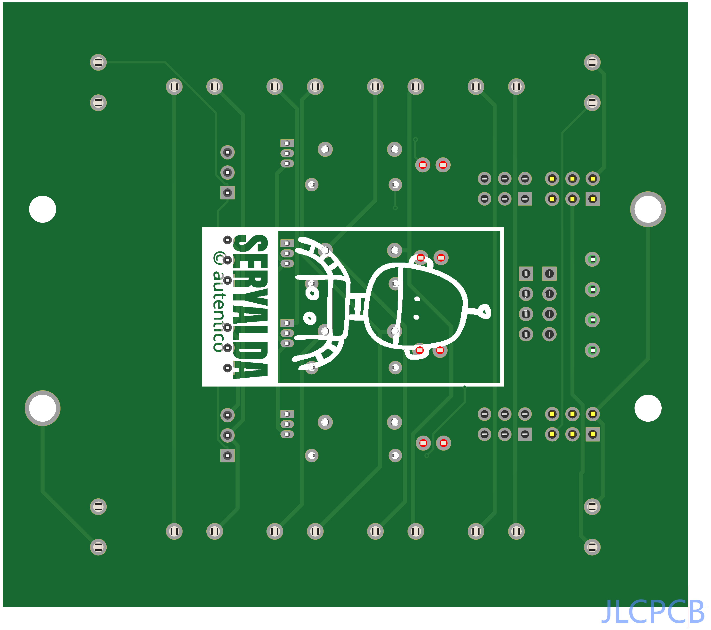

# 🚀 MARVIN PCB Board v1.0.0 Showcase

📷  | 📷  | 📷  | 📷 

## Table of Contents

- 📚 [Introduction](#introduction)
- 🎯 [Features](#features)
- 🛠️ [Usage](#usage)
- ⚙️ [Installation](#installation)
- 🤝 [Contributing](#contributing)
- 📝 [License](#license)

## Introduction

Welcome to the MARVIN PCB Board v1.0.0 showcase. This board is designed to [briefly describe its purpose and any unique features or functionalities].

## Features

List the key features of the MARVIN PCB Board v1.0.0. For example:

- 🌟 Feature 1: Describe feature 1 here.
- 🌟 Feature 2: Describe feature 2 here.
- ...

## Usage

Explain how to use the MARVIN PCB Board v1.0.0 or any associated software. Include code snippets or examples if applicable.

## Installation

If there are specific installation instructions for the MARVIN PCB Board v1.0.0 or related software, provide them here.

## Contributing

If you're open to contributions from the community, explain how others can contribute to your project. Include guidelines for reporting issues, making pull requests, and any coding standards to follow.

## License

Specify the license for the MARVIN PCB Board v1.0.0 project. For example, if it's open source, you can use a license badge and link to the license file.

---

**Note:** Emojis add a fun and expressive touch to your README. You can find emoji codes on websites like [Emojipedia](https://emojipedia.org/) or use HTML entities for more control. If you want to include specific icons, you can explore libraries like [Font Awesome](https://fontawesome.com/) and include them using HTML or Markdown as needed.
